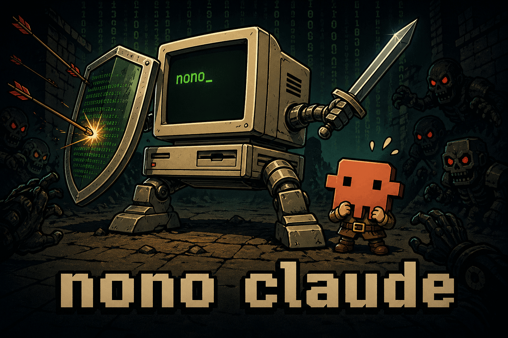

  

# claude nono

`claude` is a `nono` package / plugin for Claude Code.

It installs a Claude plugin, hook definitions, shell helpers, and a packaged skill that make Claude Code behave correctly when it is running inside a `nono` security sandbox.

## What It Does

This pack is focused on one problem: when Claude hits a sandbox boundary, it should stop guessing and explain the real fix.

The pack provides:

- a Claude plugin manifest in `.claude-plugin/plugin.json`
- hook registrations in `hooks/hooks.json`
- a `PostToolUseFailure` hook that explains hard sandbox denials
- a `PostToolUse` Bash hook that detects permission failures in shell output
- a `nono-sandbox` skill that teaches the correct diagnostic flow

## Behavior

When Claude is running inside a `nono` sandbox and a tool call fails due to blocked filesystem or network access, the installed hooks:

- detect that the session is sandboxed via `NONO_CAP_FILE`
- read the current capability set
- inject sandbox-specific context back into Claude
- instruct Claude to run `nono why` before advising the user
- steer Claude toward the two valid remediations
- recommend restarting with additional `--allow` access when needed
- recommend creating a reusable `nono` profile for repeated access

This prevents common bad guidance such as retrying the same action, suggesting `chmod`, or treating the failure like a normal OS permissions issue.

## Included Artifacts

The pack currently ships:

- `.claude-plugin/plugin.json`
- `skills/nono-sandbox/SKILL.md`
- `hooks/hooks.json`
- `bin/nono-hook.sh`
- `bin/nono-hook-bash.sh`

These artifacts are declared in [`package.json`](./package.json).

## Package Metadata

- Name: `claude`
- Pack type: `agent`
- Platforms: `macos`, `linux`
- License: `Apache-2.0`
