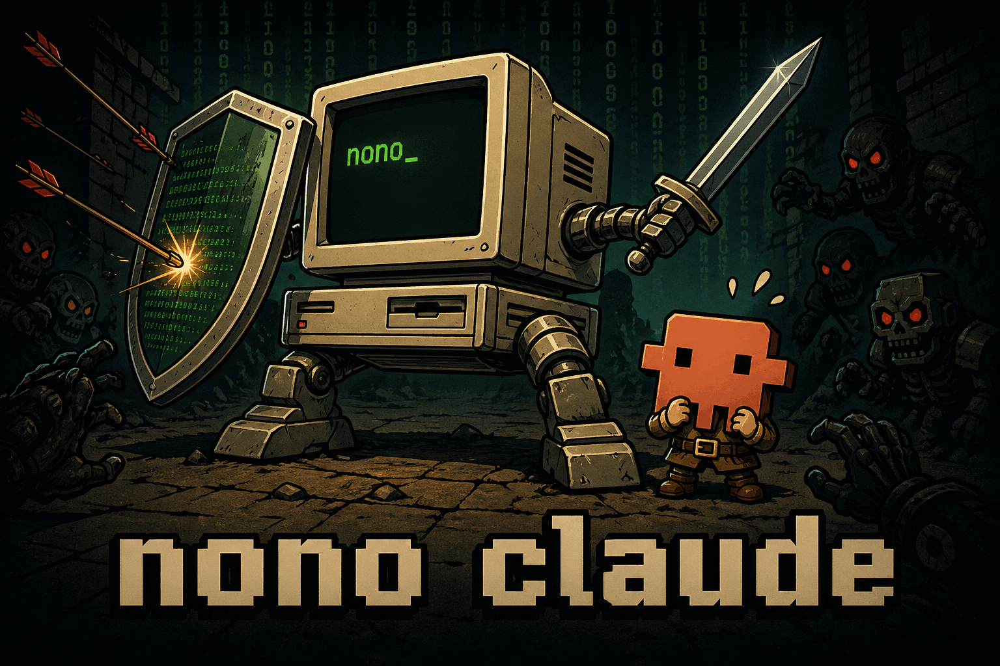

<p align="center">
  
</p>

# claude nono

`claude` is a `nono` package / plugin for Claude Code.

It installs a Claude plugin, hook definitions, shell helpers, and a packaged skill that make Claude Code behave correctly when it is running inside a `nono` security sandbox.

## Quick start

```bash
# Install the pack
nono pull nolabs-ai/claude

# Run Claude Code inside the sandbox
nono run --profile nolabs-ai/claude -- claude
```

## What It Does

This pack is focused on one problem: when Claude hits a sandbox boundary, it should stop guessing and explain the real fix.

The pack provides:

- a Claude plugin manifest in `.claude-plugin/plugin.json`
- hook registrations in `hooks/hooks.json`
- a `PostToolUseFailure` hook that explains hard sandbox denials
- a `PostToolUse` Bash hook that detects permission failures in shell output
- a `nono-sandbox` skill that teaches the correct diagnostic flow

## Behavior

When Claude is running inside a `nono` sandbox and a tool call fails due to blocked filesystem or network access, the installed hooks:

- detect that the session is sandboxed via `NONO_CAP_FILE`
- read the current capability set
- inject sandbox-specific context back into Claude
- instruct Claude to run `nono why` before advising the user
- steer Claude toward the two valid remediations
- recommend restarting with additional `--allow` access when needed
- recommend creating a reusable `nono` profile for repeated access

This prevents common bad guidance such as retrying the same action, suggesting `chmod`, or treating the failure like a normal OS permissions issue.

## Sandbox Preparation

The profile also has to make Claude Code's own runtime paths usable inside the sandbox.

On Linux it grants `$XDG_RUNTIME_DIR/cc-socks`, the directory where Claude Code binds the
AF_UNIX sockets it uses for cross-session messaging. Without it, sessions start with
`Cross-session messaging is off: its socket directory could not be set up`.

Landlock and Seatbelt can only attach a rule to a path that already exists, and a grant for
a missing path is silently skipped — so `cc-socks` (tmpfs, gone after every logout) and the
Claude state directories under `$HOME` would be dropped from the capability set on a fresh
machine. `bin/ensure-dirs.sh` runs as a `session_hooks.before` script, on the host and
before the sandbox boundary goes up, and creates them first.

## Included Artifacts

The pack currently ships:

- `.claude-plugin/plugin.json`
- `skills/nono-sandbox/SKILL.md`
- `hooks/hooks.json`
- `bin/nono-hook.sh`
- `bin/nono-hook-bash.sh`
- `bin/ensure-dirs.sh`

These artifacts are declared in [`package.json`](./package.json).

## Package Metadata

- Name: `claude`
- Pack type: `agent`
- Platforms: `macos`, `linux`
- License: `Apache-2.0`
