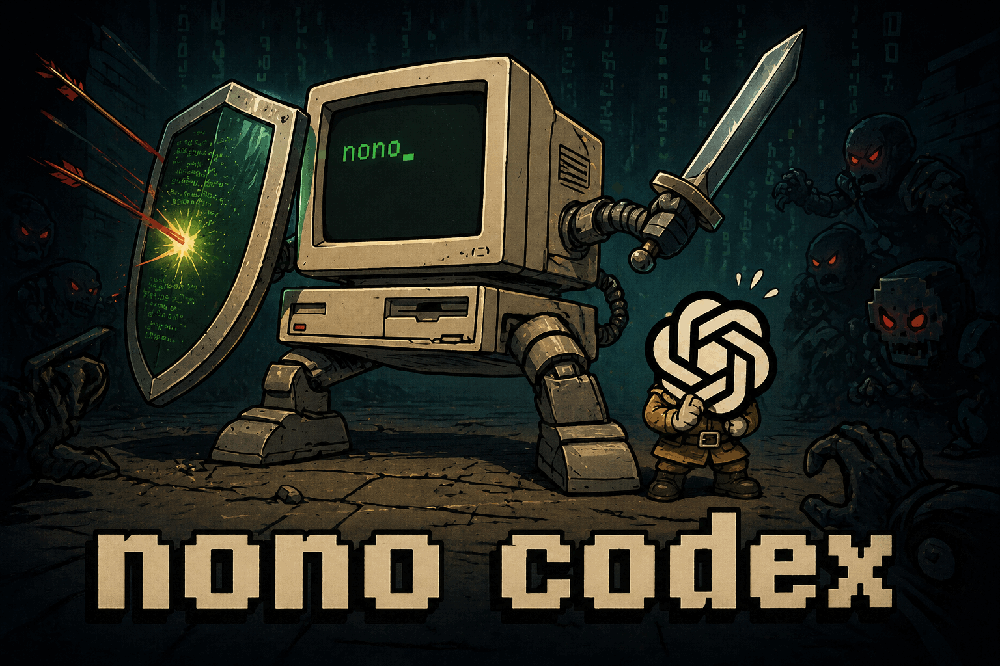

<p align="center">
  
</p>

# nono codex

Sandbox profile and Codex plugin for running [OpenAI Codex CLI](https://developers.openai.com/codex) inside a [nono](https://nono.sh) security sandbox.

Install:

```
nono run --profile nolabs-ai/codex -- codex
```

If the pack isn't already installed, nono will prompt to pull it.

## What's in the pack

- **`policy.json`** — sandbox profile (loaded as `--profile nolabs-ai/codex`). Grants `~/.codex`, `~/.agents`, `~/.config/nono/{profiles,packages}` (read-only), the OpenAI auth origin, and runtime groups for Node, Rust, Python, Nix.
- **`.codex-plugin/plugin.json`** — Codex plugin manifest, exposes the `nono-sandbox` skill.
- **`bin/nono-hook.sh`** — compatibility no-op for older installs that still have the previous `PostToolUse` hook entry.
- **`bin/nono-hook-session.sh`** — compatibility no-op for older installs that still have the previous `SessionStart` hook entry.
- **`skills/nono-sandbox/SKILL.md`** — skill describing how to diagnose and resolve sandbox denials.

## Activating sandbox guidance

`nono pull nolabs-ai/codex` writes the marketplace registration and the cache symlink, and merges a marked `nono` block into `~/.codex/config.toml` (`developer_instructions`, plus the marketplace/plugin entries) so Codex knows how to diagnose and remediate nono sandbox denials. The merge is scoped to a marked block, so your other `config.toml` settings are left untouched.

## Hook noise

Codex currently renders hook output in the TUI, even for hook entries marked `"silent": true`. This pack avoids that channel: fresh installs do not register Codex hooks. Sandbox-denial handling is provided by the `nono-sandbox` skill instead.

## Source

`https://github.com/nolabs-ai/nono-packs/tree/main/codex`

Published via Sigstore-signed releases triggered by tags matching `codex-v*`.
