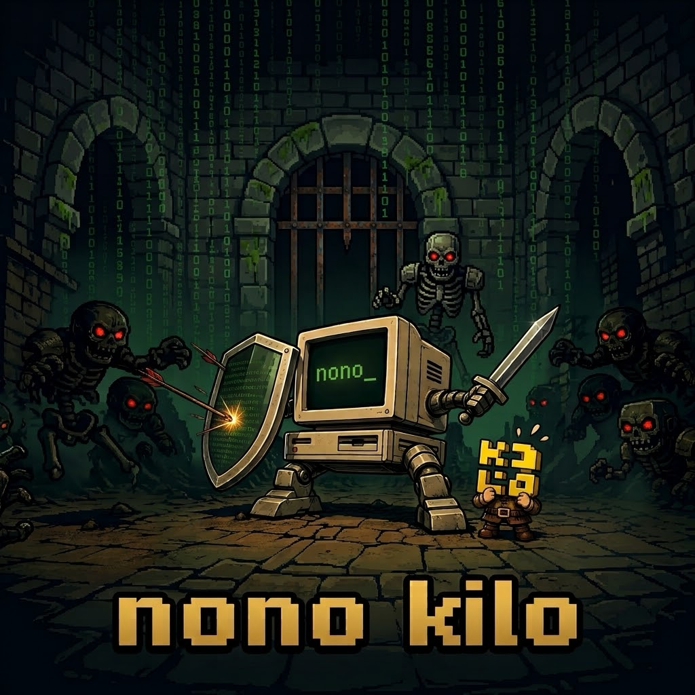

<p align="center">
  
</p>

# nono kilo

Sandbox profile and kilo-native skill for running the [Kilo Code](https://kilocode.ai) CLI agent (`kilo`) inside a [nono](https://nono.sh) security sandbox.

This pack assumes `kilo` is already installed. It does not install or pin `kilo` itself. The filesystem grants below are derived from Kilo Code's own published nono profile; if a future `kilo` release changes its config/state directory layout, this pack's `policy.json` and skill may need updating.

Install:

```bash
nono run --profile nolabs-ai/kilo -- kilo
```

If the pack is not already installed, nono will prompt to pull it.

## What's in the pack

- **`policy.json`** — sandbox profile loaded as `--profile nolabs-ai/kilo`. Grants `$HOME/.config/kilo` (config), `$HOME/.local/share/kilo` (data/repos), `$HOME/.local/state/kilo` (logs/state), `$HOME/.cache/kilo/bin` (downloaded binaries), read access to `$HOME/.kilo/bin` (the curl-installer's binary location), macOS Keychain access, and the single file `$HOME/kilo.json`, plus standard Node/Rust/Python/Nix runtime groups and read access to nono packages/profiles.
- **`skills/nono-sandbox/SKILL.md`** — kilo-native skill, installed to `$HOME/.config/kilo/skills/nono-sandbox/SKILL.md`, teaching the agent how to diagnose and respond to nono sandbox denials instead of retrying or working around them.

## Notes

- Kilo Code state lives under XDG base directories: `~/.config/kilo`, `~/.local/share/kilo`, `~/.local/state/kilo`, and `~/.cache/kilo/bin`. This profile grants exactly those paths.
- `~/kilo.json` is allow-listed as a single file (not a directory grant) — it is not a broader `$HOME` access grant.
- The curl-based installer places the `kilo` binary at `~/.kilo/bin/kilo`, outside the XDG dirs above, so this profile grants it read access to allow self-inspection (e.g. `argv0`/update checks). Invoke it by full path inside the sandbox — `~/.kilo/bin` is not added to `$PATH`.
- macOS Keychain access is granted the same way as the `claude`, `codex`, and `goose` packs: `$HOME/Library/Keychains` in both `allow` and `bypass_protection`, gated `"when": "macos"`.
- `kilo`'s interactive TUI mode (bare `kilo`, no task argument) makes a `realpath()` call on the bare `~/.local/state` (XDG state home) directory itself, not just `~/.local/state/kilo`. This isn't something kilocode's own open-source logic needs (it only ever touches `~/.local/state/kilo`) — it's Bun-runtime behavior inside the compiled TUI worker. On macOS, `allow_parent_of_protected: true` plus a `"when": "macos"`-gated `$HOME/.local/state` grant lets Seatbelt permit that parent directory while still denying nono's own protected `~/.local/state/nono` underneath it. This is macOS-only: Landlock on Linux can't express "allow this parent but deny one specific child," so the grant is scoped `"when": "macos"` and skipped entirely on Linux — bare `kilo` TUI mode remains unsandboxable there until upstream fixes it. The one-shot form (`kilo "<task>"`) doesn't hit this and works on both platforms without the extra grant.
