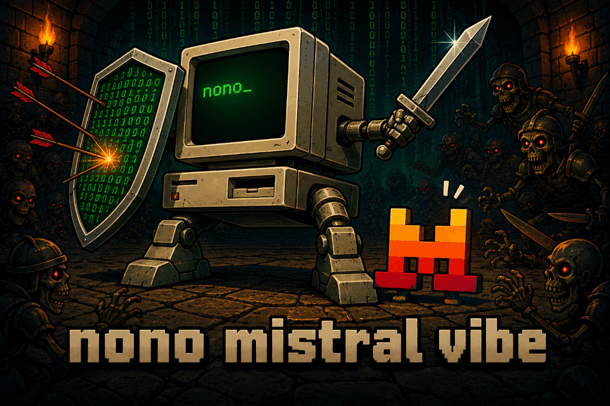

<p align="center">
  
</p>

# nono mistral-vibe

Sandbox profile for the [Mistral Vibe](https://docs.mistral.ai/vibe/code/cli/) coding agent.

Install the package and run Vibe from a project directory:

```bash
nono pull nolabs-ai/mistral-vibe
nono run --profile mistral-vibe --allow-cwd -- vibe
```

The profile includes Vibe's `~/.vibe` configuration and state, the `uv` tool tree used by the standard installer, common developer runtimes, and read access to the Vibe launcher in `~/.local/bin`. This is required because the launcher is a Python script whose interpreter normally lives under `~/.local/share/uv/tools/mistral-vibe`.

The package also installs a Vibe `post_tool` hook in `~/.vibe/hooks.toml`. When a tool reports a likely nono denial, the hook adds the active capabilities and the next steps for diagnosing the boundary or creating a profile extension. The hook is passive for ordinary tool failures, uses Vibe's native hook contract, and is invoked through `/bin/bash` so package installation does not need to preserve executable file permissions.

The Mistral credential route is defined but not enabled by default. Add `"mistral"` to `network.credentials` in a profile extending `nolabs-ai/mistral-vibe` if you want nono to inject `MISTRAL_API_KEY` from the host keychain.

The agent login capability via OAuth2 is fully supported, allowing the agent to authenticate with mistral.ai directly.
